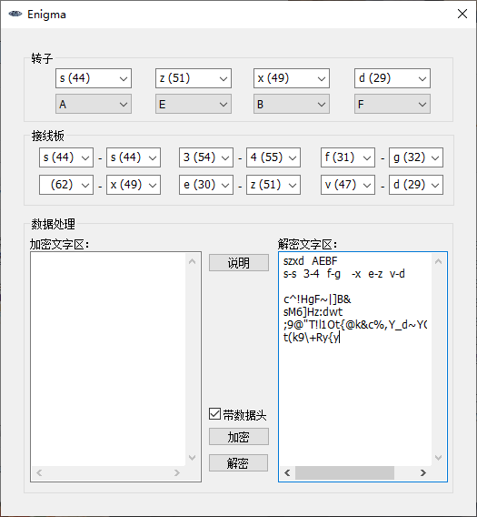

# 恩尼格码密码机

标签（空格分隔）： MFC C++ Enigma

---

这是一个模仿二战时期德国的著名的恩尼格码密码机设计的一个软件

 - 软件截图

 - 使用方法
 加密：设置好软件上的转子和接线板，将需要加密的文字输入“加密文字区”点击“加密”按键，软件会把这段文字加密并显示在“解密文字区”
 解密：将已经加密的文字输入到“解密文字区”，并点击“解密”按键，软件将自动配置转子和接线板，并按照配置解密文字。软件会把这段文字解密并显示在“加密文字区”

